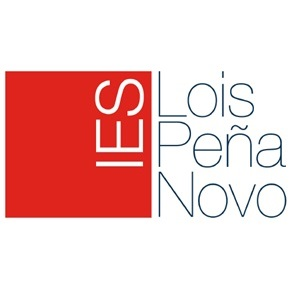

# Adan David  Nezha Xabier

## 2º Sistemas Microinformáticos y Redes

### **Unidad: 2**   

### **Práctica Nº: 1**  
### **Título: debate obsolescencia**   

### **Fecha: 10/11/25**  

  

  <a href="https://centros.edu.xunta.gal/iesloispenanovo/aulavirtual/course/view.php?id=460" target="_blank"><b>Seguridad Informática</b></a>

---

# Índice

# Seguridad informática: 
Los productos nacen con vida útil limitada, desde elegir materiales que se desgastan rápido, hasta actualizaciones del software que lo vuelven lento o directamente incompatible, el objetivo es claro, incentivar que compres más seguido, y así generar más ingresos para las marcas.
Riesgo colectivo: Un solo dispositivo vulnerable puede comprometer redes enteras, especialmente en entornos empresariales o domésticos conectados.

# Responsabilidad compartida:
Fabricantes: Tienen la responsabilidad ética de diseñar productos duraderos, actualizables y reparables.
Los usuarios:Deben adoptar hábitos de consumo responsable, evitando el reemplazo innecesario por moda o marketing.

# Derecho a reparar:
La obsolescencia programada dificulta la reparación de los productos, lo que obliga a los consumidores a comprar nuevos en lugar de arreglar los antiguos.
Muchos fabricantes impiden el acceso a piezas, manuales o software necesario para reparar.
El impacto social: Esto afecta especialmente a comunidades con menos recursos, que no pueden reemplazar fácilmente sus dispositivos.

# Diseño irreparable:
Los consumidores se ven obligados a gastar dinero en reparaciones o a adquirir nuevos productos de forma más frecuente y 
aunque el dispositivo funcione, se vuelve inutilizable o demasiado costoso de reparar.

la obsolescencia programada proboca la generacion masiva de residuos electronicos toxicos la sobreexplotacion de recursos naturales para fabricar nuevos productos y un aumento en los gases de efecto invernadero asociados a la produccion el transporte y la eliminacion de los productos
 
 
 

## competitividad entre empresas
las empresas diseñan productos que necesitan ser remplazados en un periodo determinado generando ingresos continuos y asegurando la demanda 
 
 
 

## generacion de riqueza
las empresas diseñan productos con vida util limitada lo que lleva a los comsumidores a comprar dispositivos mas nuevos y modernos con mas frecuencia asegurando demanda constante y un flujo constante de ingresos